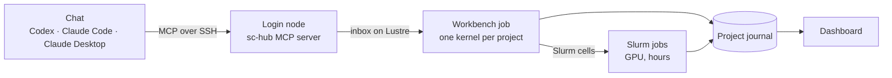

# sc-hub

[](https://github.com/eizorerad/sc-hub/actions/workflows/tests.yml)
[](LICENSE)


A lab bench for single-cell and computational biology on the MBZUAI Slurm cluster,
driven by the student's coding assistant (Codex, Claude Code, Claude Desktop) over
MCP. Everything runs under the student's own cluster account. Everything the
assistant does lands in a journal the student reads on a dashboard.

**[Start](#start-student)** · **[How it works](#how-it-works-in-brief)** ·
**[For the pilot owner](#for-the-pilot-owner)** · **[Docs](docs/)**

> [!NOTE]
> The goal is a working tool for the biologist, not a perfect sc-hub. Setup is one
> guided run. After it, the assistant's sessions are about research.

## Start (student)

On your laptop, from a copy of this repository:

```bash
sh onboard/start.sh                                             # macOS, Linux
onboard\start.cmd                                               # Windows 10/11
```

> [!TIP]
> Or paste the repository link into Codex or Claude Code and ask it to set you up.
> Its `AGENTS.md` tells it to start the setup page and hand it to you.

A local page walks through each step with a progress bar:
1. Sign in to the cluster once. The password goes to `ssh`, never to the assistant.
2. sc-hub is installed on the cluster, and a first cell and Slurm job run.
3. Your assistants, VS Code in your workbench job, and Codex and Claude Code on the cluster (with your student accounts) are connected.
4. The dashboard starts.

If a step fails, the page says what to do. Your assistant can also diagnose and
fix it ([docs/setup.md](docs/setup.md)).

Then work in the workspace and ask for research. In Codex type `$schub`, in Claude Code `/schub`:

```bash
cd ~/sc-hub-workspace && codex      # or: claude
```

> "$schub Create a project for my question: how does the IFN-beta response differ
> between PBMC cell types? Start from Kang 2018."

sc-hub is on only there. Everywhere else your assistants work without it, and so can
you on the cluster, with your own login and your own folders; sc-hub keeps to
`/l/users/LOGIN/schub`. A longer task can be handed to the lab agent on the cluster:
agree it with your assistant, which then delegates it and follows it
([how it works](docs/how-it-works.md)).

## How it works, in brief



- **Cells.** The assistant acts through **cells**: code with a required *why* and *expect*, run in a live kernel inside the student's workbench job. Heavy work goes to a `%%slurm` cell, which becomes its own job.
- **The journal.** Each cell becomes an entry in the project's **journal**: outputs, figures, files, downloads, jobs and **checks** (a failed check marks the entry). The dashboard shows the journal. A new chat starts from its hand-over. A finished study becomes a **report** notebook.
- **The lab agent.** It can keep working on a goal between chats, in Slurm slices.
- **The key.** On the login node the SSH key runs only sc-hub's own commands (`schub-gate`). VS Code, if installed, gets a shell inside your own workbench job ([details](docs/setup.md#install-student-one-command)).

Details: [docs/how-it-works.md](docs/how-it-works.md). The older brick
pipelines: [docs/bricks.md](docs/bricks.md).

## For the pilot owner

| Task | Command |
|---|---|
| Review fixes from students' assistants | pull requests `fix/onboard-*`: the `tests` check must be green; merge into the branch students clone |
| Give a project a lab agent | `schub goal-start <project> --goal goal.md`; `schub goal-status` / `goal-stop` |
| Write the report of a finished project | `schub goal-report <project>` |
| Choose the lab agents' engines | `schub engine-policy set mixed --primary claude`, `... grant <project> codex`, `schub engine-probe` |
| Run the breadth evaluation | `schub eval-run evals/requests.yaml --engines claude,codex`, later `schub eval-score evals/requests.yaml --markdown` |
| Publish a shared library (optional) | `bash scripts/publish_library.sh` on the cluster; a workspace uses it with `SCHUB_LIBRARY=<library>` ([docs/setup.md](docs/setup.md)) |
| Build and publish the older installers | `SCHUB_LIBRARY_ROOT=<cluster folder> bash scripts/release.sh` |
| Install Cell Ranger (10x license) | `bash scripts/install_cellranger.sh '<link>' human` on the cluster |

## Development

```bash
uv venv --python 3.12 .venv && uv pip install --python .venv/bin/python -e ".[dev]"
.venv/bin/python -m pytest          # then tests/e2e/run.sh for the dashboard
```

GitHub Actions runs the tests on every push and pull request. More:
[docs/development.md](docs/development.md).

## License

Apache-2.0: see [LICENSE](LICENSE) and [NOTICE](NOTICE). The optional analysis
extras pull in `igraph` (GPL-2.0+) and `leidenalg` (GPL-3.0), which are not part of
this package: check their terms before redistributing an environment that bundles
them. `scripts/install_cellranger.sh` does not ship Cell Ranger: each user downloads
it after accepting 10x Genomics' license.
